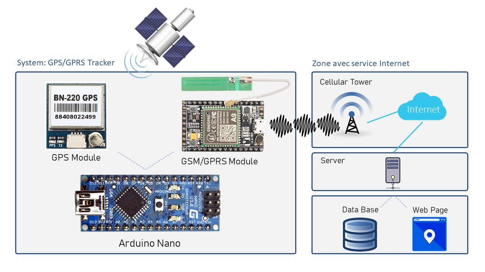
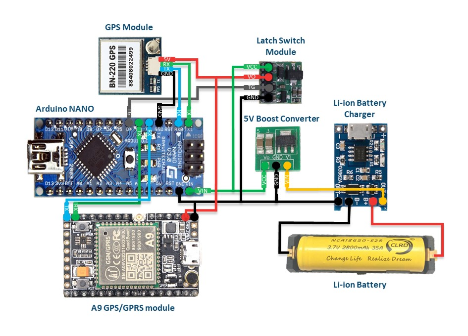
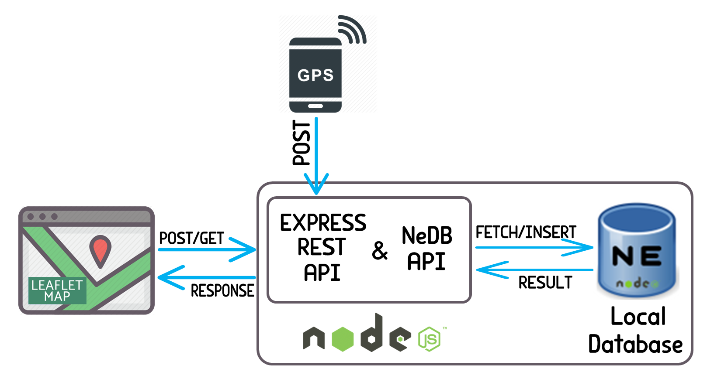

# **GPS/GPRS Vehicle Tracker**

# **Dedication**

  I dedicate this project to God Almighty my creator. I also dedicate this work to my two families who have offered me enormous encouragement and support, the first is my parents my sister my brother and my friend Ahmed Bangoura who is my second brother. My second family is the students of ENSIAS school who commit themselves and work hard to make the school better with their sense of help and sharing.
    
# **Table of Conetents**

- [**GPS/GPRS Vehicle Tracker**](#gpsgprs-vehicle-tracker)
- [**Dedication**](#dedication)
- [**Table of Conetents**](#table-of-conetents)
- [**Wishlist**](#wishlist)
- [**Source Files**](#source-files)
- [**Description**](#description)
- [**Overview**](#overview)
- [**Hardware**](#hardware)
  - [GPS Module](#gps-module)
  - [GSM/GPRS Module](#gsmgprs-module)
  - [Reduce Power](#reduce-power)
  - [Solar Panel](#solar-panel)
  - [Bill of Materials](#bill-of-materials)
  - [More Materials](#more-materials)
  - [Circuit Design](#circuit-design)
  - [Measured Current](#measured-current)
- [**Software**](#software)
  - [Firmware Part](#firmware-part)
  - [BN-220 GPS](#bn-220-gps)
  - [A9 GSM/GPRS](#a9-gsmgprs)
  - [Execution flow diagram](#execution-flow-diagram)
  - [Web Part](#web-part)
  - [Screen Shot of the Web Application](#screen-shot-of-the-web-application)
- [**Experimental Results**](#experimental-results)

# **Wishlist**

For Version 2.0
- Switch to a smaller microcontroller like ATTINY-85
- Use UBX protocol instead of NMEA protocol in GPS module
- Make my system independent of the car battery
- Add car motion detection
- Add authentification web page
- Add option in web page to show history of tracking for specifi date

# **Source Files**
    .
    ├── driver              # Driver for peripherals
    |   ├── adc.cpp             # Driver for analog to digital converter of ATMEGA328 
    |   ├── uart.cpp            # Driver for the UART protocol of ATMEGA328
    |   └── softuart.cpp        # Library that use GPIO and interrupt to simulate protocol UART
    ├── img                 # README files (images) 
    ├── lib                 # Libraries for modules and functionalities of microcontroller
    |   ├── A9.cpp              # Lib for A9 GSM/GPRS module
    |   ├── GPS.cpp             # Lib for parsing NMEA sentences given by the GPS
    |   ├── Power.h             # Lib for power management of ATMEGA328
    |   └── Sleep.h             # Lib to control sleep modes of ATMEGA328 
    ├── webApp              # Web application source files
    |   ├── node_modules        # Folder containing node modules required for server application to work 
    |   ├── db                  # Folder containing the database files
    |   ├── home.html           # Home web page
    |   └── server.js           # Server app javascript program
    ├── main.cpp            # Main program
    ├── LICENSE
    └── README.md    

# **Description**

The purpose of this personal project was to design and realize a system that would be implemented in bikes and vehicles in order to keep track of them. Thus it is also designed to be build-able for small cost and be small as well. It is based on ATMEGA 328P (Arduino Nano), GPS module (BN-220) and GSM/GPRS module (Ai-Thinker A9).

The main challenges I am interessed in are:
- How small can I make my prototype hardware ?
- How small can I make my software ?
- How long can my system stay alive in self-powered mode ?

The idea behind how the system works will be described in details in [**Overview**](#overview) section.

# **Overview**

As shown in following image, the location is acquisitioned from satellite using GPS receiver, then it will be preprocessed with Arduino Nano microcontroller which after that will send the location coordination to the server through GPRS module that will contain a valid SIM card. The request goes through the internet to the server side where website and database are located. The data acquired will be saved in database and displayed in the user's browser as a marker on the map.

# **Hardware**

The microcontroller I choose to use for my first prototype was the arduino Nano, its specification satisfy my need for this project. It can operate at a frequency up tp 16Mhz, it can go into different sleep modes, it has enough GPIOS and UART-I2C-ADC peripherals which are the only ones needed for this application.

## GPS Module

The choice of this module depended on how much space and power it takes, its price and also for its availability on the aliexpress market. So the choice fell on the BN-220 module that weighs 5.3g, with a dimension of 22mm*20mm\*6mm and with current consumption of : 50mA (Active mode) - 7.5mA (standby mode) . This module is based on the ublox-M8030 chip, it contains a Flash memory that allows to save configuration and has an UART interface.

## GSM/GPRS Module

I chose the A9 module from AI-Thinker because it's lightweight, offers several functions and it is a low power module. It has an SD-Card and SIM-Card interface as well as a UART interface for communication with microcontrollers. The power consumption is lesser than 10mAh, also it can be powered with 3.7V Li-ion battery. Its size: 40mm*55mm.

## Reduce Power

There is a low power mode that can be enabled by software in modules when they are inactive and can minimize power consumption, but the value consummed cannot be considered negligible that why to extend more life battery I searched for latch switch circuit that can cut-off definitly power from modules connected to Arduino and thus reducing significantly power consumption.

## Solar Panel

Working on it for version 2.0

## Bill of Materials

All materiels discussed was bought from AliExpress and here is the bill:

Material | Price
---------|------
Arduino Nano | 3.4$
BN-220 GPS | 9.8$
Ai-Thinker A9 GPRS/GSM | 11$
Switch Latch module | 
Lipo Battery Charger TP4056 | 0.4$
**Total** | 24.6$

## More Materials

I used other materials that each maker should have. 

[USB Analyzer](https://a.aliexpress.com/_mqt8Z6L) helps me to visualize the low level details of signals used in protocols communication and it saved me lot of time in debugging.

I also used [USB power meter](https://a.aliexpress.com/_mN3DxiF) to keep tracking of current consumption when I switch modules and microcontroller from their active mode to standby mode. It helps me to try different techniques to reduce power consumption and to choose the best solar panel that will power my whole system.

So I used [FTDI chip](https://a.aliexpress.com/_m0YMKaJ) that convert USB protocol to UART protocol to test each module directly, without using arduino which is tired work, since they have UART interface.

## Circuit Design

The image below shows how wiring between different parts of system was done:

## Measured Current

In progress.

# **Software**

The software for this project can be split up into two parts: **Firmware and Web** Application. **The firmware** objectif is to provide the location of the vehicle to the app server. Then at the server side, new location of vehicle will be stored in local database.

When client is connected, the server serves it the HTML webpage containing a map showing the tracking of the user vehicle.

Currently the website is hosted at : https://gps--tracker.herokuapp.com

## Firmware Part

The firmware is not based on arduino Framework, instead it uses pure C and C++ so as to take less memory and can be uploaded even to smaller chips like ATTINY85.

So as to free up more space, I decided to get rid of the bootloader (it also make starting of microcontroller fast) and to write my own drivers and libraries. 

In the following sections I describe how each module works and how to establish communication with them.

## BN-220 GPS

When the GPS is on, the GPS satellites broadcast the signals and GPS receivers use the signals and some calculation to provide periodicly some informations like latitude, longitude and altitude in format of NMEA 0182 protocol. 

The types of informations generated depends on which sentence of protocol NMEA is chosen. So as to configure the GPS module either use the u-Center software which has GUI and easy to use (this software is compatible with just ublox chip) or by sending to RX pin of GPS module commands which can be found in ublox chip datasheet.

The communication is done through the UART interface and when data is received, microcontroller parse it, check it validity and and extract from it the informations needed.

## A9 GSM/GPRS

After that microcontroller gathered necesseraly data, it creates an HTTP request and send it by using the A9 GPS/GPRS module which is a modem that use GSM AT-commands to communicate with microcontroller. Here you can find reference to differents AT-commands supported by this module : [link here](https://docs.ai-thinker.com/_media/b_and_t/nb-iot/n92/kaifazhidaowendang/rda8908a_at_commandmanual9.0.pdf)

The communication is also done through UART interface.

    Note: It's better to buy A9G module which is an upgraded version of the A9 with additional features like GPS and get rid of BN-220 gps module that I'm using. This will reduce more energy consumption. 

## Execution flow diagram

The system execution will follow the steps described in this diagram :

    <image src="img/Execution_Flow _Diagram.png">

## Web Part

For the development of the web plateform, I used the following languages and technologies : Javascript, NodeJS, HTML, CSS, Leaflet. 

The server processes the post request received by the tracking system, it retrieves position and battery level then store it in the local database which is controled by the NeDB API. The data is requested periodically through the user web page using HTTP protocol, then the data is returned in JSON format and mapped into Leaflet map.

The following image clearly shows the web architecture :

## Screen Shot of the Web Application

In progress.

# **Experimental Results**

In progress.